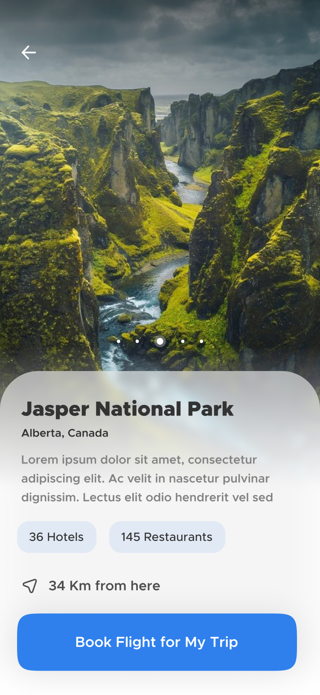

# Design 2 Flutter - Travel App

 

Designed by [Atiqur Rahaman](https://dribbble.com/atiq31416)

## Hey there! 👋😁

Thanks for checking out this front-end coding challenge.

[Design 2 Flutter](https://www.reddit.com/r/Design2Flutter/) challenges helps you improve your design to coding Flutter skills by building professional projects.

**To do this challenge, you need a basic understanding of Dart and Flutter.**

## The challenge

Your challenge is to create travel app (home and details screen) and get it looking as close to the design as possible.

## Getting Started

1. Download/Fork the starter project.
2. Set up the project with version control.
3. Setup the project challenge however you want.
4. Start coding!

## Completion Levels

Beginner - Completed Static screen (no interactive component)

Advanced - Beginner + Have interactive components (scrollable carousel stack)

## Suggestions

- Work in a team with friends
- Get your solution as close to the design as possible
- Time yourself. Write down how long you will take, and how long you actually took.

## Submitting your solution

Submit your solution with a screenshot to the [Design2Flutter subreddit](https://www.reddit.com/r/Design2Flutter/) with the solution flair.

Tweet your work on Twitter with the tag [@Design2Flutter](https://twitter.com/Design2Flutter) and hashtag [#design2flutter](https://twitter.com/search?q=%23design2flutter&src=typeahead_click) and include the reddit post.

Share on your LinkedIn and tag [me](https://www.linkedin.com/in/haris-samingan-7889b9140/).
